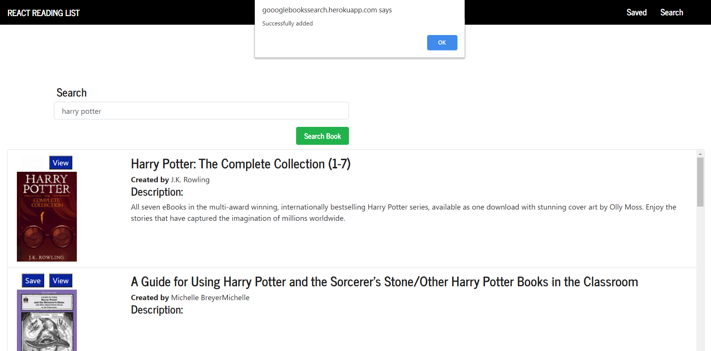
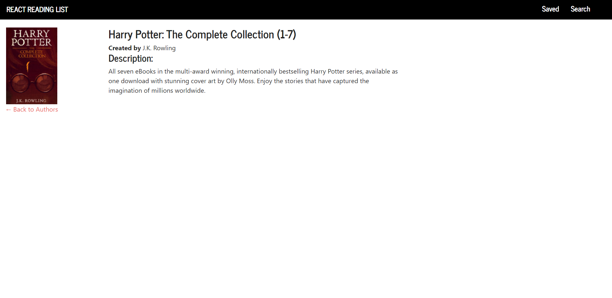

# Google-Books-React-Search
## Description
An application that allows user to search for a book from GoogleBook and save it to a Mongo Database and the option to remove it.
## Technologies used
* [HTML5](#HTML5)
* [CSS3](#CSS3)
* [NODEJS](#NODEJS)
* [JAVASCRIPT](#JAVASCRIPT)
* [React](#React)
* [MongoDB](#MongoDB)
* [EXPRESS](#EXPRESS)
## Installation
npm intall
## Usage
npm start
## badges
 
#### URL Github Repo:
https://aminbouzouita.github.io/Google-Books-React-Search/.
#### App Link On Heroku:
https://goooglebookssearch.herokuapp.com/books/search
#### Screenshots:

